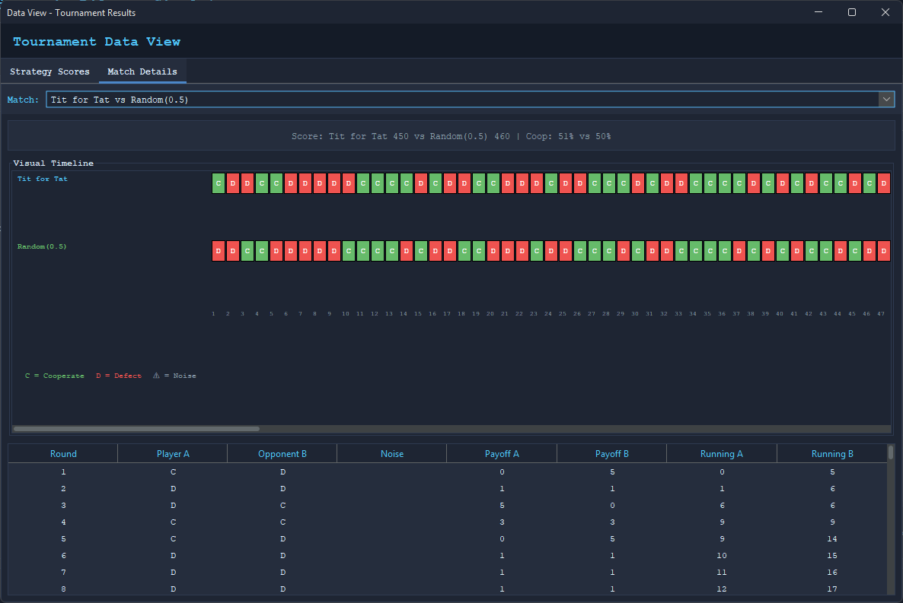

# Iterative Prisoner's Dilemma Simulator

A JavaFX desktop application for simulating Robert Axelrod's famous Iterated Prisoner's Dilemma tournaments.

> **References on Axelrod's Tournament Strategies:**
> - [Stanford Encyclopedia: Prisoner's Dilemma](https://plato.stanford.edu/entries/prisoner-dilemma/index.html#AxelTitForTat)
> - [Stanford Encyclopedia: Strategy Table](https://plato.stanford.edu/entries/prisoner-dilemma/strategy-table.html)

---

## About

This is a work in progress **practice project** built to learn JavaFX while exploring game theory concepts. The Iterated Prisoner's Dilemma is a classic model for understanding how cooperation emerges between self-interested agents.

---

## The Prisoner's Dilemma

The Prisoner's Dilemma is a classic game theory scenario where two players must choose to **Cooperate** or **Defect** without knowing the other's choice. The payoff matrix determines outcomes:

```
                         Opponent
                  Cooperate    Defect
                ┌────────────┬────────────┐
  You  Cooperate│    R=3     │    S=0     │
                ├────────────┼────────────┤
       Defect   │    T=5     │    P=1     │
                └────────────┴────────────┘
               
  R = Reward (both cooperate)    T = Temptation (you defect, they cooperate)
  P = Punishment (both defect)   S = Sucker (you cooperate, they defect)
```

The **dilemma**: individually, defection always yields a better outcome—but mutual defection is worse than mutual cooperation.

### Why Iterated?

In the **single-shot** game, defection is rational. But when players interact **repeatedly**, cooperation can emerge. Robert Axelrod's tournaments in *The Evolution of Cooperation* (1984) showed that simple strategies can thrive in iterated games.

### The Strategy Table

| Strategy | Round 1 | After Opponent Cooperates | After Opponent Defects |
|----------|---------|---------------------------|------------------------|
| **Tit For Tat** | C | C | D |
| **Always Defect** | D | D | D |
| **Always Cooperate** | C | C | C |
| **Grim Trigger** | C | C | D (forever) |

---

## Inspiration

This project is inspired by Robert Axelrod's groundbreaking book *The Evolution of Cooperation* (1984), which documented his computer tournaments where different strategies competed against each other. The winning strategy? **Tit For Tat** - simple, nice, retaliatory, and forgiving.

### Resources

- [Veritasium - Game Theory and the Future of Cooperation](https://www.youtube.com/watch?v=mScpHTIi-kM)
- [Robert Axelrod's *The Evolution of Cooperation* on Wikipedia](https://en.wikipedia.org/wiki/The_Evolution_of_Cooperation)

---

## Strategies Included

| Category | Strategy | Description |
|----------|----------|-------------|
| **Basic** | Always Cooperate | Naive - always cooperates |
| | Always Defect | Always defects (exploits but mutual harm) |
| | Random | Random choice (50/50) |
| **Reciprocal** | Tit For Tat | Cooperates first, then mirrors opponent |
| | Tit For Two Tats | Requires 2 defections before retaliating |
| | Suspicious Tit For Tat | Like TFT but starts by defecting |
| | Generous Tit For Tat | TFT but occasionally forgives |
| | Gradual Tit For Tat | Escalating retaliation pattern |
| **Conditional** | Pavlov | Win-stay, lose-shift |
| | Grim Trigger | Cooperates until defected, then always defects |

---

## Features

- **Round-robin tournaments** - Every strategy competes against every other
- **Configurable rounds** - Set the number of iterations per match
- **Noise simulation** - Add probability of accidental defections
- **Payoff customization** - Modify reward/punishment values
- **Score rankings** - See how strategies perform overall
- **Visualization** - Bar charts for scores
- **Match details** - View individual round outcomes
- **CSV export** - Export tournament results

---

## Screenshots

### Main Tournament View


### Score Chart


### Match Details


---

## Getting Started

### Prerequisites

- Java 21 or later
- Maven 3.8+

### Build & Run

```bash
# Clone the repository
git clone https://github.com/ahwz/IterativePrisonersDilemma.git
cd IterativePrisonersDilemma

# Build with Maven
mvn clean package

# Run the application
mvn exec:java -Dexec.mainClass="dev.ahwz.ipd.ui.SwingGui"
```

### Run Tests

```bash
mvn test
```

---

## Project Structure

```
src/main/java/dev/ahwz/ipd/
├── Main.java              # Entry point
├── model/                 # Domain classes
│   ├── Action.java        # COOPERATE, DEFECT
│   ├── Strategy.java      # Strategy interface
│   ├── GameHistory.java   # Move history tracking
│   ├── PayoffMatrix.java  # Configurable payoffs
│   └── MatchResult.java   # Match outcomes
├── strategies/            # Strategy implementations
├── engine/                # Tournament & Match engines
├── ui/                    # JavaFX UI components
└── util/                  # Export utilities
```

---

## License

MIT License - See [LICENSE](LICENSE)

---

*Inspired by Robert Axelrod's "The Evolution of Cooperation" (1984)*
