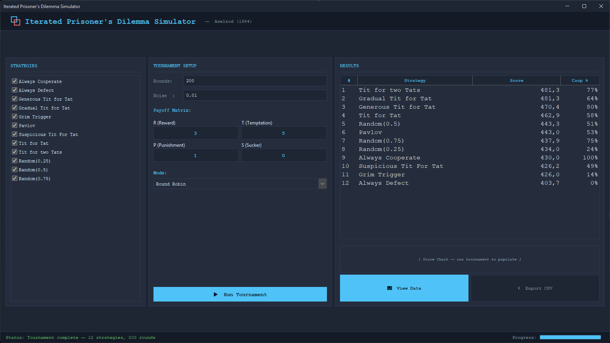

# Iterative Prisoner's Dilemma Simulator

A JavaFX desktop application that simulates Robert Axelrod's famous tournaments from *The Evolution of Cooperation*. Users can create tournaments between different strategies, analyze results, and explore how cooperation emerges in iterated games.

---

# 1. Project Overview

## Core Features

1. **Strategy Management**
   - Pre-built strategies (Tit For Tat, Always Defect, etc.)

2. **Tournament Execution**
   - Round-robin tournaments
   - Configurable rounds per match
   - Custom payoff matrices

3. **Results & Visualization**
   - Score rankings
   - Bar charts for scores
   - Cooperation rate statistics
   - Pairwise match results

4. **Export**
   - Export results to CSV

---

# 2. Domain Model

## 2.1 Action Enum
- **COOPERATE**: Player chooses to cooperate
- **DEFECT**: Player chooses to defect

## 2.2 Strategy Interface
Every strategy implements this interface:
- `getName()`: Display name for UI
- `nextMove(GameHistory history)`: Core decision logic, receives full game history
- `reset()`: Optional method to reset state between matches

## 2.3 GameHistory Class
Provides access to game history for decision-making:
- `isFirstMove()`: Check if this is the first round
- `getMyLastMove()` / `getOpponentLastMove()`: Get most recent moves
- `getMyMoves()` / `getOpponentMoves()`: Get all moves
- `getTotalRounds()`: Get current round number
- `recordMove(Action myMove, Action opponentMove)`: Record a move

## 2.4 PayoffMatrix Class
Configurable payoff matrix with four values:
- **Reward (R)**: Both cooperate - default 3
- **Temptation (T)**: You defect, they cooperate - default 5
- **Punishment (P)**: Both defect - default 1
- **Sucker (S)**: You cooperate, they defect - default 0

## 2.5 MatchResult Class
Contains results of a single match:
- Player A and B strategies
- Individual moves for each player
- Final scores for each player
- Cooperation rates for each player

## 2.6 TournamentResult Class
Contains results of an entire tournament:
- Total scores for each strategy
- Cooperation rates for each strategy
- List of all match results
- Ranked list of strategies by score

---

# 3. Strategy Implementations

## 3.1 Basic Strategies

| Strategy | Behavior |
|----------|----------|
| **Always Cooperate** | Always chooses COOPERATE |
| **Always Defect** | Always chooses DEFECT |
| **Random** | Randomly chooses COOPERATE or DEFECT |

## 3.2 Reciprocal Strategies

| Strategy | Behavior |
|----------|----------|
| **Tit For Tat** | Cooperates first, then copies opponent's last move |
| **Tit For Two Tats** | Like TFT but requires two defections before retaliating |
| **Generous Tit For Tat** | Like TFT but occasionally forgives defections |

## 3.3 Trigger Strategies

| Strategy | Behavior |
|----------|----------|
| **Grim Trigger** | Cooperates until opponent defects, then defects forever |
| **Pavlov (Win-Stay, Lose-Shift)** | Repeats last move after reward/temptation, switches after punishment/sucker |

---

# 4. Game Engine

## 4.1 Match Engine
Plays a repeated game between two strategies for N rounds.

Key responsibilities:
- Initialize fresh histories for both players
- Loop through configured number of rounds
- Get moves from both strategies
- Apply noise (if configured) to randomly flip moves
- Calculate payoffs using the payoff matrix
- Record all moves in histories
- Return MatchResult with scores and move history

## 4.2 Tournament Engine
Runs round-robin tournaments where every strategy plays every other strategy.

Key responsibilities:
- Create score tracking for all strategies
- For each pair of strategies, play matches (both home and away)
- Accumulate scores from all matches
- Calculate cooperation rates
- Generate final rankings
- Return TournamentResult

---

# 5. Roadmap

## 5.1 New Strategies

Additional strategies to implement:

| Strategy | Category | Behavior |
|----------|----------|----------|
| **Adaptive Tit For Tat** | Reciprocal | Adjusts cooperation based on recent opponent behavior |
| **Downing** | Reciprocal | Attempts to model opponent's strategy |
| **Prober** | Exploitative | Tests if opponent is firm, then exploits |
| **Resurrected Prober** | Exploitative | Prober variant with recovery mechanism |
| **Soft Majoritarian** | Trigger | Defects if opponent defects too often |
| **Nydegger** | Reciprocal | Uses memory of specific move sequences |
| **Grofman** | Reciprocal | Groups moves into categories, cooperates more often |
| **Shubik** | Punisher | Counts defections, punishes proportionally |
| **Friedman** | Trigger | Like Grim Trigger but with limited retaliation |
| **Davis** | Trigger | Cooperates initially, then defects if provoked |
| **Graaskamp** | Reactive | Responds to defection patterns |
| **Tullock** | Exploitative | Initial defections to test opponent |
| **Eatherly** | Trigger | Like Grim Trigger but with occasional forgiveness |
| **Colet** | Reactive | Similar to TFT with probabilistic elements |
| **Reverse Tit For Tat** | Reciprocal | Defects first, then cooperates |
| **Betting** | Exploitative | Alternates strategies based on score |

## 5.2 Custom Strategy Builder

GUI-based tool for creating strategies without coding:

- Select first move (Cooperate/Defect/Random)
- Configure response to opponent cooperation
- Configure response to opponent defection
- Set retaliation thresholds
- Test against built-in strategies

## 5.3 Evolutionary Tournament

Simulates population dynamics over generations:

- Initial population with equal representation
- Each generation plays round-robin
- Reproduction proportional to score
- Track population share over time
- Visualize with line chart

## 5.4 Pairwise Heatmap Visualization

Grid showing scores between each pair of strategies:

- Color-coded cells for quick comparison
- Useful for understanding direct matchups
- Identify exploitable strategies

---

# 6. JavaFX UI Architecture

## 6.1 Project Structure

```
src/main/java/dev/ahwz/ipd/
├── Main.java                    # Application entry point
├── model/                       # Domain classes
│   ├── Action.java
│   ├── Strategy.java
│   ├── GameHistory.java
│   ├── PayoffMatrix.java
│   └── MatchResult.java
├── strategies/                  # Built-in strategy implementations
├── engine/                      # Game and tournament engines
│   ├── Match.java
│   └── Tournament.java
├── ui/                          # Swing UI components
│   └── ...
└── util/                        # Utilities (export, etc.)
```

## 6.2 Main Window Layout



**Panel Layout:**
- **Left** - Strategy selection (checkbox list)
- **Center** - Tournament settings (rounds, payoff matrix)
- **Right** - Results (rankings, scores)

## 6.3 Controller Design

**MainController:**
- Manages overall application state
- Coordinates between strategy list, settings, and results panels
- Runs tournament in background thread
- Updates progress bar and status label

---

# 7. Visualization Features

## 7.1 Score Bar Chart
Horizontal or vertical bar chart showing total scores for each strategy, sorted by rank.

## 7.2 Cooperation Rate Display
Shows what percentage of each strategy's moves were cooperative, helpful for understanding strategy behavior.

## 7.3 Pairwise Heatmap
Grid showing scores between each pair of strategies. Useful for understanding direct matchups.

## 7.4 Match Details
When clicking a result, show:
- All moves made in sequence
- Score progression over rounds
- Key decision points

---

# 8. Export Options

- **CSV**: Strategy, Score, Cooperation Rate
- **JSON**: Full tournament data with match details
- **Screenshot**: Save chart as PNG

---

# 9. Development Phases

## Phase 1: Core Simulation

| Task | Description |
|------|-------------|
| Create project structure | Maven setup, Java |
| Implement domain model | Action, Strategy, GameHistory, etc. |
| Implement basic strategies | AlwaysC, AlwaysD, TFT, Random |
| Implement Match engine | Single match execution |
| Implement Tournament engine | Round-robin execution |
| Console testing | Verify tournament runs correctly |

**Deliverable:** Command-line tournament runner

## Phase 2: JavaFX UI

| Task | Description |
|------|-------------|
| Setup JavaFX project | Scene Builder, FXML |
| Main window layout | Three-panel design |
| Strategy selection list | Checkbox list with all strategies |
| Settings panel | Spinners for rounds, noise, payoff values |
| Results table | Sortable ranking table |
| Run button + progress | Async tournament execution |

**Deliverable:** Functional desktop app with basic UI

## Phase 3: Visualization

| Task | Description |
|------|-------------|
| Score bar chart | Chart integration |
| Cooperation rate display | Add column to results table |
| Heatmap view | Grid showing pairwise results |
| Match detail view | Click to see individual match data |

**Deliverable:** Visual analysis tools

## Phase 4: Polish & Export

| Task | Description |
|------|-------------|
| Export functionality | CSV/JSON export |
| Polish | Error handling, styling |

**Deliverable:** Production-ready application

---

# 10. Testing Plan

## Unit Tests
Test individual strategies and components:
- Strategy decision logic
- GameHistory tracking
- Payoff calculations
- Match result computation

## Integration Tests
Test component interactions:
- Tournament produces correct rankings
- Results match expected behavior from Axelrod's research
- UI updates correctly after tournament

## Key Test Cases
- Tit For Tat scores higher than Always Defect
- Grim Trigger cooperates with itself
- Random performs worse than reciprocal strategies
- Two generous strategies achieve mutual cooperation

---

# 11. Key Insights from Axelrod's Research

1. **Tit For Tat wins consistently** - Its success comes from being nice, retaliatory, and forgiving.

2. **Nice strategies win** - Never defect first. Being nice is evolutionarily stable in most environments.

3. **Retaliation maintains cooperation** - Once established, cooperation must be defended against exploitation.

4. **Forgiveness helps recover** - After accidental defection (noise), forgiving strategies recover cooperation faster.

5. **Clarity matters** - Strategies should be understandable to promote mutual cooperation.

---

This plan provides a complete roadmap for building a professional-quality Iterative Prisoner's Dilemma simulator with JavaFX.
